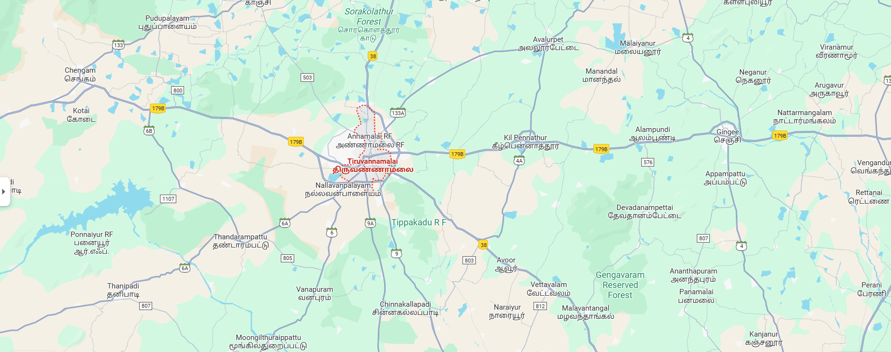
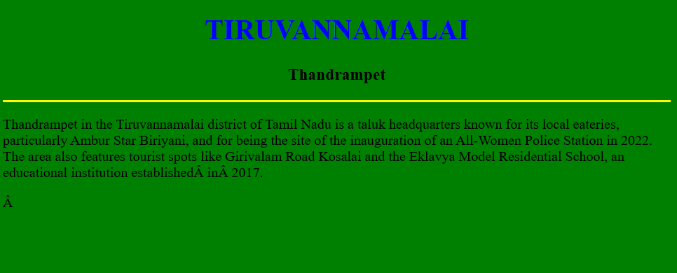
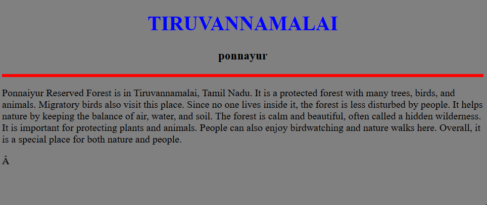
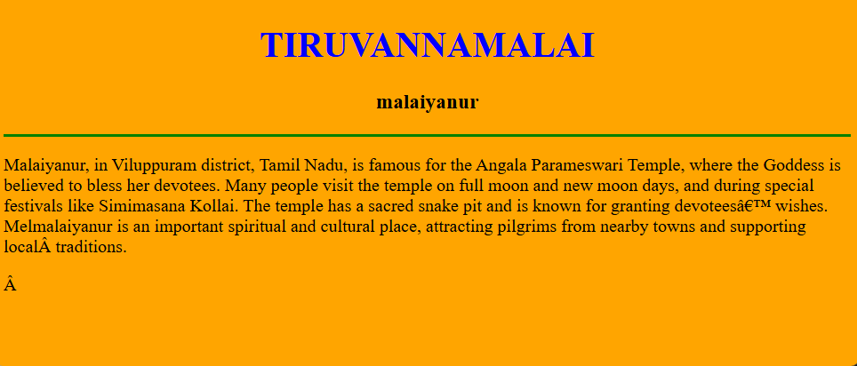
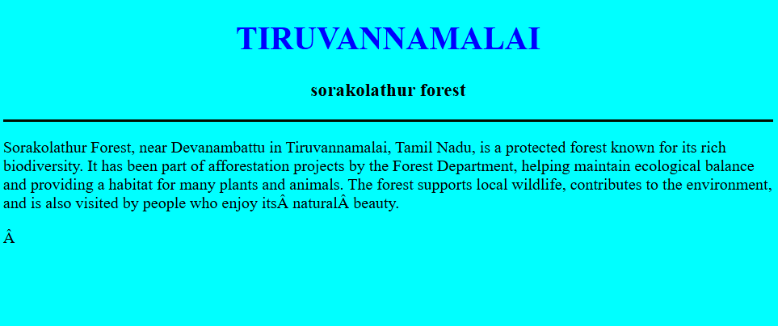
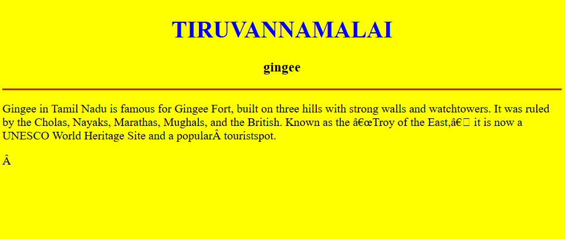

# Ex04 Places Around Me
## Date:27/09/2025

## AIM
To develop a website to display details about the places around my house.

## DESIGN STEPS

### STEP 1
Create a Django admin interface.

### STEP 2
Download your city map from Google.

### STEP 3
Using ```<map>``` tag name the map.

### STEP 4
Create clickable regions in the image using ```<area>``` tag.

### STEP 5
Write HTML programs for all the regions identified.

### STEP 6
Execute the programs and publish them.

## CODE
~~~

map.html

<!DOCTYPE html>
<html>
<head>
<title>My city</title>
</head>
<body>
<h1 align="center">
<font color="red"><b>TIRUVANNAMALAI</b></font>
</h1>
<h2 align="center">
<font color="blue"><b>VIJIYALAKSHMI A (25017569)</b></font>
</h2>
<center>    


<map name="My city">
    <area target="_blank" alt="" title="" href="Thandrampet.html" coords="415,455,640,555" shape="rect">
    <area target="_blank" alt="" title="" href="ponnayur.html" coords="57,402,308,570" shape="rect">
    <area target="_blank" alt="" title="" href="malaiyanur.html" coords="1242,5,1405,137" shape="rect">
    <area target="_blank" alt="" title="" href="forest.html" coords="625,-1,890,136" shape="rect">
    <area target="_blank" alt="" title="" href="gingee.html" coords="1413,231,1582,317" shape="rect">
</map>
</center>
</body>
</html>

Thandrampet.html

<!DOCTYPE html>
<html>
    <body bgcolor="green">
        <h1 align="center">
         <font color="blue"><b>TIRUVANNAMALAI</b></font>  
        </h1>
        <h3 align="center">
            <font color="black"<b>Thandrampet</b></font>
        </h3>
        <hr size="3" color="yellow">
        <p font color="black">Thandrampet in the Tiruvannamalai district of Tamil Nadu is a taluk headquarters known for its local eateries, particularly Ambur Star Biriyani, and for being the site of the inauguration of an All-Women Police Station in 2022. The area also features tourist spots like Girivalam Road Kosalai and the Eklavya Model Residential School, an educational institution established in 2017.</p>
        
    </body>
</html>

ponnayur.html

<!DOCTYPE html>
<html>
    <body bgcolor="grey">
        <h1 align="center">
         <font color="blue"><b>TIRUVANNAMALAI</b></font>  
        </h1>
        <h3 align="center">
            <font color="black"<b>ponnayur</b></font>
        </h3>
        <hr size="5" color="red">
        <p font color="black">Ponnaiyur Reserved Forest is in Tiruvannamalai, Tamil Nadu. It is a protected forest with many trees, birds, and animals. Migratory birds also visit this place. Since no one lives inside it, the forest is less disturbed by people. It helps nature by keeping the balance of air, water, and soil. The forest is calm and beautiful, often called a hidden wilderness. It is important for protecting plants and animals. People can also enjoy birdwatching and nature walks here. Overall, it is a special place for both nature and people.</p>
        
    </body>
</html>

malaiyanur.html

<!DOCTYPE html>
<html>
    <body bgcolor="orange">
        <h1 align="center">
         <font color="blue"><b>TIRUVANNAMALAI</b></font>  
        </h1>
        <h3 align="center">
            <font color="black"<b>malaiyanur</b>
        </h3>
        <hr size="3" color="green">
        <p font color="black">Malaiyanur, in Viluppuram district, Tamil Nadu, is famous for the Angala Parameswari Temple, where the Goddess is believed to bless her devotees. Many people visit the temple on full moon and new moon days, and during special festivals like Simimasana Kollai. The temple has a sacred snake pit and is known for granting devotees’ wishes. Melmalaiyanur is an important spiritual and cultural place, attracting pilgrims from nearby towns and supporting local traditions.</p>
        
    </body>
</html>

forest.html

<!DOCTYPE html>
<html>
    <body bgcolor="cyan">
        <h1 align="center">
         <font color="blue"><b>TIRUVANNAMALAI</b></font>  
        </h1>
        <h3 align="center">
            <font color="black"<b>sorakolathur forest</b>
        </h3>
        <hr size="3" color="rose">
        <p font color="black">Sorakolathur Forest, near Devanambattu in Tiruvannamalai, Tamil Nadu, is a protected forest known for its rich biodiversity. It has been part of afforestation projects by the Forest Department, helping maintain ecological balance and providing a habitat for many plants and animals. The forest supports local wildlife, contributes to the environment, and is also visited by people who enjoy its natural beauty.</p>
        
    </body>
</html>

gingee.html

<!DOCTYPE html>
<html>
    <body bgcolor="yellow">
        <h1 align="center">
         <font color="blue"><b>TIRUVANNAMALAI</b></font>  
        </h1>
        <h3 align="center">
         <font color="black"<b>gingee</b>
        </h3>
        <hr size="3" color="red">
        <p font color="black">Gingee in Tamil Nadu is famous for Gingee Fort, built on three hills with strong walls and watchtowers. It was ruled by the Cholas, Nayaks, Marathas, Mughals, and the British. Known as the “Troy of the East,” it is now a UNESCO World Heritage Site and a popular touristspot.</p>
    </body>
</html>

~~~

## OUTPUT









## RESULT
The program for implementing image maps using HTML is executed successfully.
